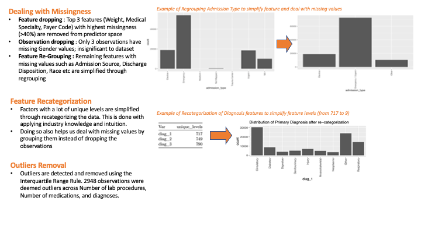
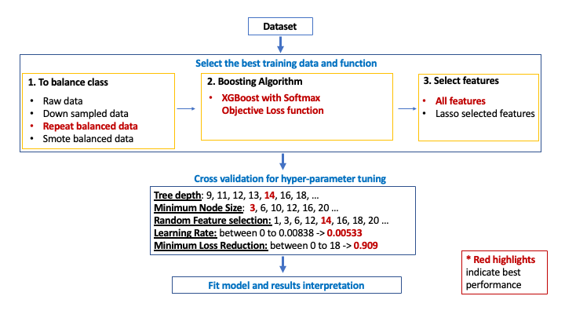
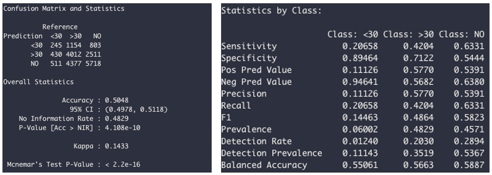
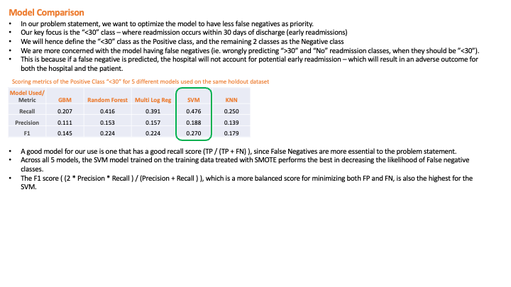

```{r setup, include=FALSE}
knitr::opts_chunk$set(echo = TRUE)
```

## Problem

```{r, out.width = "1000px", echo=FALSE, fig.align="center"}
knitr::include_graphics("Images/Problem.png")
```

---


## Introduction of the dataset

```{r, out.width = "900px", echo=FALSE, fig.align="center"}
knitr::include_graphics("Images/dataset_intro.png")
```

---

## Challenge of data

```{r, out.width = "900px", echo=FALSE, fig.align="center"}
knitr::include_graphics("Images/challenges_2.png")
```

---


## IDA - Missingness, Outlier, Correlation and Low information features

```{r, out.width = "900px", echo=FALSE, fig.align="center"}
knitr::include_graphics("Images/IDA_slide.png")
```

---


## Data Cleaning 

```{r, out.width = "900px", echo=FALSE, fig.align="center"}

```

---


## Imbalanced Class

```{r, out.width = "900px", echo=FALSE, fig.align="center"}
knitr::include_graphics("Images/Imbalanced_class_slide.png")
```

---


## Treating Imbalanced Class

```{r, out.width = "900px", echo=FALSE, fig.align="center"}
knitr::include_graphics("Images/down_over_sampling_slide.png")
```

---

## Feature Selection

```{r, out.width = "900px", echo=FALSE, fig.align="center"}
knitr::include_graphics("Images/Feature_selection_slide.png")
```

---

## *k*-nearest neighbours tuning

```{r, out.width = "900px", echo=FALSE, fig.align="center"}
knitr::include_graphics("Images/knn_method.png")
```

---

## *k*-nearest neighbours results

```{r, out.width = "1200px", echo=FALSE, fig.align="center"}
knitr::include_graphics("Images/CM_plot_table.png")
```

---

## Random Forest Methodology

```{r, out.width = "950px", echo=FALSE, fig.align="center"}
knitr::include_graphics("Images/Random forest methodology.png")
```

---

## Random Forest Results

```{r, out.width = "950px", echo=FALSE, fig.align="center"}
knitr::include_graphics("Images/Random forest results.png")
```


---

## SVM Methodology

```{r, out.width = "950px", echo=FALSE, fig.align="center"}
knitr::include_graphics("Images/SVM methodology.png")
```

---

## SVM Best Result

```{r, out.width = "950px", echo=FALSE, fig.align="center"}
knitr::include_graphics("Images/SVM best result.png")
```

---

## Multinomial Logistic Regression 

```{r, out.width = "900px", echo=FALSE, fig.align="center"}
knitr::include_graphics("Images/logistic_regression_1.png")
```

---

## Multinomial Logistic Regression (cont.) 

```{r, out.width = "900px", echo=FALSE, fig.align="center"}
knitr::include_graphics("Images/logistic_regression_2.png")
```

---

## GBM Methodology

```{r, out.width = "900px", echo=FALSE, fig.align="center"}

```

---

## GBM Results

```{r, out.width = "980px", echo=FALSE, fig.align="center"}

```

---

## Model Comparison

```{r, out.width = "980px", echo=FALSE, fig.align="center"}

```

---

## Future improvement

```{r, out.width = "900px", echo=FALSE, fig.align="center"}
knitr::include_graphics("Images/Future improvement.png")
```


