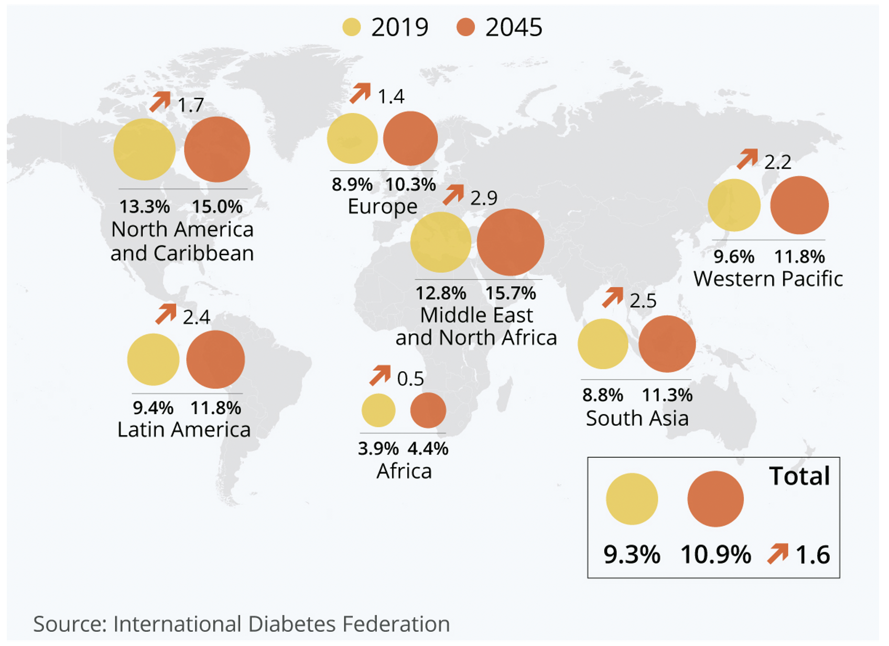

```{r setup, include=FALSE}
knitr::opts_chunk$set(echo = TRUE)
```

## Slide 1

```{r, out.width = "700px", echo=FALSE, fig.align="center"}

```


---


## Slide 2

Introduction of the dataset - Jenny

---


## Slide 3

Challenge of data - Jenny

---


## Slide 4

IDA - missingness, low information columns, correlation - Macy

---


## Slide 5

IDA - data cleaning - Leonard

---


## Slide 6

train/test split
Imbalanced Class - Macy

---


## Slide 7

Treating Imbalanced class - Macy

---

## Slide 8

Feature selection - Macy

---

## *k*-nearest neighbours tuning

<!-- Speech (to delete): We first consider the k Nearest Neighbours method. -->
<!-- To tune the hyperparameter k for best accuracy while minimizing computational time, we adopt the heuristic that the best k is approximately equal to root N where N is the number of points. -->
<!-- By iterating around this value, we obtain our best k estimate. -->

```{r, out.width = "900px", echo=FALSE, fig.align="center"}
knitr::include_graphics("Images/knn_method.png")
```

---

## *k*-nearest neighbours results

<!-- Looking at this heatmap visualisation of the confusion matrix, we find that the kNN model fails to predict any instances of the ‘<30’ class in the test set.  -->
<!-- Second, the model fails to be sensitive to readmissions, which is critical to the goal of our project. -->

```{r, out.width = "1200px", echo=FALSE, fig.align="center"}
knitr::include_graphics("Images/CM_plot_table.png")
```

---

## Slide 11

Model 2 - Random Forest
Methodology


---

## Slide 12

Model 2 - Random Forest
Results

---

## Slide 13

Model 3 - SVM
Methodology

---

## Slide 14

Model 3 - SVM
Results

---

## Slide 15

Model 4 - Logistic Regression
Methodology

---

## Slide 16

Model 4 - Logistic Regression
Results

---

## Slide 17

Model 5 - Decision Tree/GBM
Methodology

---

## Slide 18

Model 5 - Decision Tree/GBM
Results

---

## Slide 19

Conclusion - which model performs the best - Leonard

---

## Slide 20

Future improvement - Jenny and Hui


