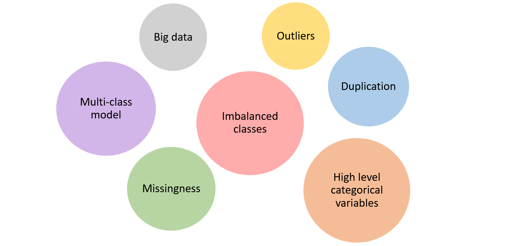
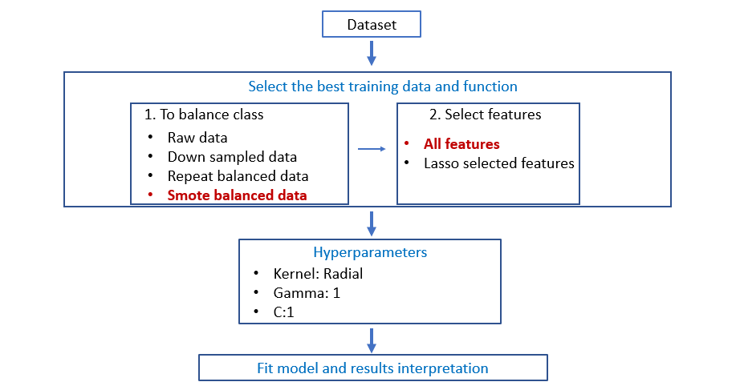

```{r setup, include=FALSE}
knitr::opts_chunk$set(echo = TRUE)
```

## Problem

<!-- The prevalence of diabetes is growing rapidly all over the world. -->

<!-- Hospitalized diabetes patients have a higher risk of hospital readmission after discharge from hospital. -->

<!-- This generates significant burden to the patients and the health care system. -->

<!-- Identifying this group of patients will improve the management of the high readmission rate. -->


```{r, out.width = "1000px", echo=FALSE, fig.align="center"}
knitr::include_graphics("Images/Problem.png")
```


---


## Introduction of the dataset

<!-- Speech (to delete): Our dataset represents 10 years of hospital admission cases for patients diagnosed with diabetes. There're 55 categorical and numerical features that cover a variety of demographical and clinical data. Our goal is to build a multi classifier that predict chance of patient readmission.
-->

```{r, out.width = "900px", echo=FALSE, fig.align="center"}
knitr::include_graphics("Images/dataset_intro.png")
```

---

## Challenge of data

<!-- Key challenges for the analysis include: big sample size which increases execution time and computational cost; messy data that requires proper cleaning in order to filter outliers, remove duplications and handle missing data; building a multi-class classifier; rebalancing imbalanced classes; and processing high level categorical variables in the data.

-->

```{r, out.width = "900px", echo=FALSE, fig.align="center"}

```

---


## IDA - Missingness, Outlier, Correlation and Low information features

```{r, out.width = "900px", echo=FALSE, fig.align="center"}
knitr::include_graphics("Images/IDA_slide.png")
```

---


## Slide 5

IDA - data cleaning - Leonard

---


## Imbalanced Class

```{r, out.width = "900px", echo=FALSE, fig.align="center"}

```

---


## Treating Imbalanced Class

```{r, out.width = "900px", echo=FALSE, fig.align="center"}
knitr::include_graphics("Images/down_over_sampling_slide.png")
```

---

## Feature Selection

```{r, out.width = "900px", echo=FALSE, fig.align="center"}
knitr::include_graphics("Images/Feature_selection_slide.png")
```

---

## *k*-nearest neighbours tuning

<!-- Speech (to delete): We first consider the k Nearest Neighbours method. -->
<!-- To tune the hyperparameter k for best accuracy while minimizing computational time, we adopt the heuristic that the best k is approximately equal to root N where N is the number of points. -->
<!-- By iterating around this value, we obtain our best k estimate. -->

```{r, out.width = "900px", echo=FALSE, fig.align="center"}
knitr::include_graphics("Images/knn_method.png")
```

---

## *k*-nearest neighbours results

<!-- Looking at this heatmap visualisation of the confusion matrix, we find that the kNN finds it difficult to predict the ‘<30’ and '>30' classes in the test set.  -->
<!-- This means the model is not sensitive to readmissions, which is critical to the goal of our project. -->

```{r, out.width = "1200px", echo=FALSE, fig.align="center"}
knitr::include_graphics("Images/CM_plot_table.png")
```

---

## Random Forest Methodology
<!-- Then we built a random forest model, we firstly tried different dataset to balance the class, and found only down sample data was able to pick up the minority class group. Then we tried different functions and features, and performed hyper-parameter tuning. (with or without: The red highlights indicate tests with best performance.) -->

```{r, out.width = "950px", echo=FALSE, fig.align="center"}
knitr::include_graphics("Images/Random forest methodology.png")
```

---

## Random Forest Results

<!-- We fit the model with best hyper-parameters, and found the sensitivity of each class is around 40%. Random forest is a powerful classifier, however, it may generate bias when there are categorical variables with multiple levels. And there are 14 such kind of variables in the current data. -->

```{r, out.width = "950px", echo=FALSE, fig.align="center"}

```


---

## SVM Methodology

```{r, out.width = "950px", echo=FALSE, fig.align="center"}

```

<!-- In SVM, we also experimented with different datasets and different features. 
We used Raw data, downsampled and Oversampled data that using SMOTE. 
We also tried training on full features and selected only features.
From those experiments, we found that by using SMOTE data, with all features, it yielded the best performance with test data. 

These experiments used hyperparameters as follows 
-->

---

## SVM Best Result

```{r, out.width = "950px", echo=FALSE, fig.align="center"}
knitr::include_graphics("Images/SVM best result.png")
```

<!-- We fit the model with best hyperparameters, and got the average performance on 5-Fold is around 52%,
Better than the other experiments which only got around 45%. 
On the test set, we got 45% average in terms of specificity and 72% in terms of specificity. And all of them are balance for three classes
-->

---

## Multinomial Logistic Regression 

<!-- We then fit multinomial logistic regression and applied different combination of class balancing and feature selection technique. Model based on raw data and all features gives the best accuracy of 54%, however sensitivity and specificity is highly skewed, with no instances predicted to be <30 days class. 
-->

```{r, out.width = "900px", echo=FALSE, fig.align="center"}

```

---

## Multinomial Logistic Regression (cont.) 

<!-- Downsampling the data gives better prediction for the two minor classes that we're most interested in, but in the meanwhile it lowers the overall accuracy to 43%, and risks removing useful information in the sample. Running the algorithm for downsampled data takes only 15 second and is computationally efficient.
-->

```{r, out.width = "900px", echo=FALSE, fig.align="center"}
knitr::include_graphics("Images/logistic_regression_2.png")
```

---

## Slide 17

Model 5 - Decision Tree/GBM
Methodology

---

## Slide 18

Model 5 - Decision Tree/GBM
Results

---

## Slide 19

Conclusion - which model performs the best - Leonard

---

## Future improvement

<!-- There are several ways we can improve the performance of the model. Firstly, combine the two classes, patients readmitted within 30 days and  after 30 days, which have similar clinical meanings.
We can also increase observation number, reduce categorical variable levels, adjust threshold for existing models, and try other classification algorithms.-->


```{r, out.width = "900px", echo=FALSE, fig.align="center"}
knitr::include_graphics("Images/Future improvement.png")
```


