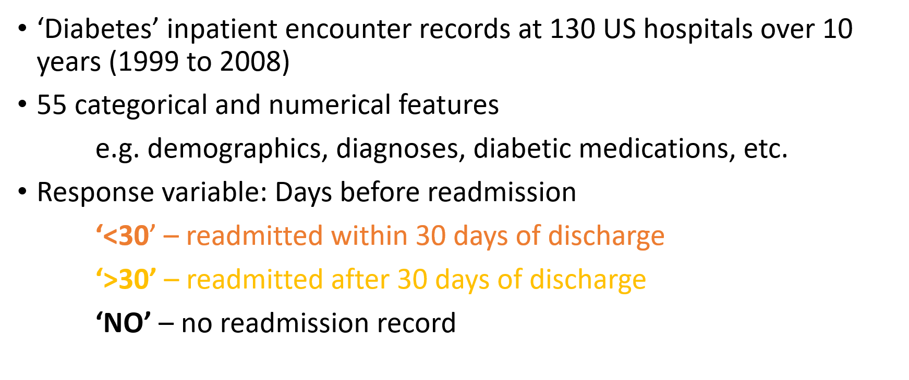

```{r setup, include=FALSE}
knitr::opts_chunk$set(echo = TRUE)
```

## Problem

<!-- The prevalence of diabetes is growing rapidly all over the world. -->

<!-- Hospitalized diabetes patients have a higher risk of hospital readmission after discharge from hospital. -->

<!-- This generates significant burden to the patients and the health care system. -->

<!-- Identifying this group of patients will improve the management of the high readmission rate. -->


```{r, out.width = "1000px", echo=FALSE, fig.align="center"}
knitr::include_graphics("Images/Problem.png")
```


---


## Introduction of the dataset

<!-- Speech (to delete): The dataset we chose for the study represents 10 years of hospital admission cases for patients diagnosed with diabetes. There’re 55 categorical and numerical features that cover a variety of demographical and clinical data. Our goal is to build a model that discriminate patients readmitted within 30 days of discharge against patients readmitted after 30 days or never come back.
-->

```{r, out.width = "900px", echo=FALSE, fig.align="center"}

```

---


## Challenge of data

<!-- Speech (to delete): The key challenges for the analysis include: 1) Big data – there’s over 100k observations in our data, which means longer execution time and higher computational cost; 2) data is messy and requires proper cleaning in order to filter outliers, remove duplications and handle missing data; 3) the problem we’re solving is to build a multi-class classifier, which is extension from building a binary model; 4) the classes are imbalanced, thus requires further balancing.

-->

```{r, out.width = "900px", echo=FALSE, fig.align="center"}
knitr::include_graphics("Images/challenges_2.png")
```

---


## IDA - Missingness, Outlier, Correlation and Low information features

```{r, out.width = "900px", echo=FALSE, fig.align="center"}
knitr::include_graphics("Images/IDA_slide.png")
```

---


## Slide 5

IDA - data cleaning - Leonard

---


## Imbalanced Class

```{r, out.width = "900px", echo=FALSE, fig.align="center"}
knitr::include_graphics("Images/Imbalanced_class_slide.png")
```

---


## Treating Imbalanced Class

```{r, out.width = "900px", echo=FALSE, fig.align="center"}

```

---

## Feature Selection

```{r, out.width = "900px", echo=FALSE, fig.align="center"}
knitr::include_graphics("Images/Feature_selection_slide.png")
```

---

## *k*-nearest neighbours tuning

<!-- Speech (to delete): We first consider the k Nearest Neighbours method. -->
<!-- To tune the hyperparameter k for best accuracy while minimizing computational time, we adopt the heuristic that the best k is approximately equal to root N where N is the number of points. -->
<!-- By iterating around this value, we obtain our best k estimate. -->

```{r, out.width = "900px", echo=FALSE, fig.align="center"}
knitr::include_graphics("Images/knn_method.png")
```

---

## *k*-nearest neighbours results

<!-- Looking at this heatmap visualisation of the confusion matrix, we find that the kNN model fails to predict any instances of the ‘<30’ class in the test set.  -->
<!-- Second, the model fails to be sensitive to readmissions, which is critical to the goal of our project. -->

```{r, out.width = "1200px", echo=FALSE, fig.align="center"}
knitr::include_graphics("Images/CM_plot_table.png")
```

---

## Random Forest Methodology
<!-- Then we built a random forest model, we firstly tried different dataset to balance the class, and found only down sample data was able to pick up the minority class group. Then we tried different functions and features, and performed hyper-parameter tuning. (with or without: The red highlights indicate tests with best performance.) -->

```{r, out.width = "950px", echo=FALSE, fig.align="center"}
knitr::include_graphics("Images/Random forest methodology.png")
```

---

## Slide 12

Model 2 - Random Forest
Results

---

## Slide 13

Model 3 - SVM
Methodology
<!-- In SVM, we also experimented with different datasets and different features. 
We used Raw data, downsampled and Oversampled data that using SMOTE. 
We also tried training on full features and selected only features.
From those experiments, we found that by using SMOTE data, with all features, it yielded the best performance with test data. 

These experiments used hyperparameters as follows 
-->

---

## Slide 14

Model 3 - SVM
Results
<!-- We fit the model with best hyperparameters, and got the average performance on 5-Fold is around 52%,
Better than the other experiments which only got around 45%

---

## Logistic Regression Methodology

<!-- Speech (to delete): We then fit multinomial logistic regression, which uses maximum likelihood estimation to evaluate the probability of class membership. We applied different combination of up/down sampling and feature selection technique. Model based on raw data and all features gives the best accuracy of around 54%, however like KNN model, sensitivity and specificity for the prediction is highly skewed, with no instances predicted to be in <30 days class. 
-->

```{r, out.width = "900px", echo=FALSE, fig.align="center"}
knitr::include_graphics("Images/logistic_regression_1.png")
```

---

## Slide 16

Model 4 - Logistic Regression
Results

---

## Slide 17

Model 5 - Decision Tree/GBM
Methodology

---

## Slide 18

Model 5 - Decision Tree/GBM
Results

---

## Slide 19

Conclusion - which model performs the best - Leonard

---

## Slide 20

Future improvement - Jenny and Hui


