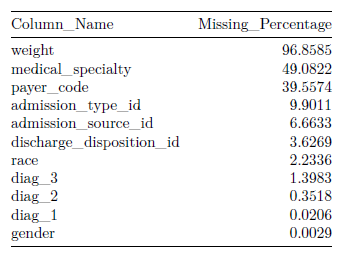
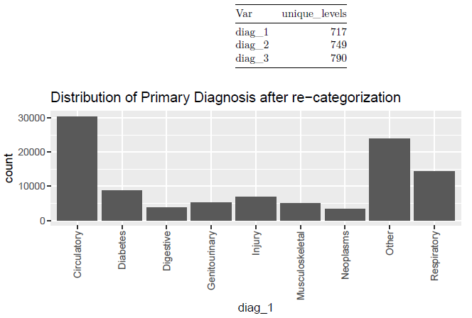
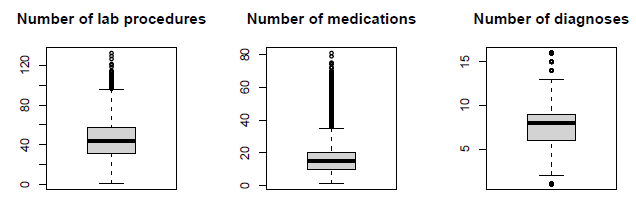
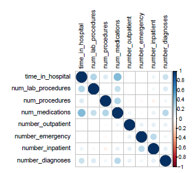
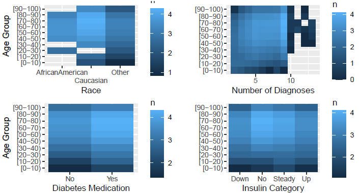
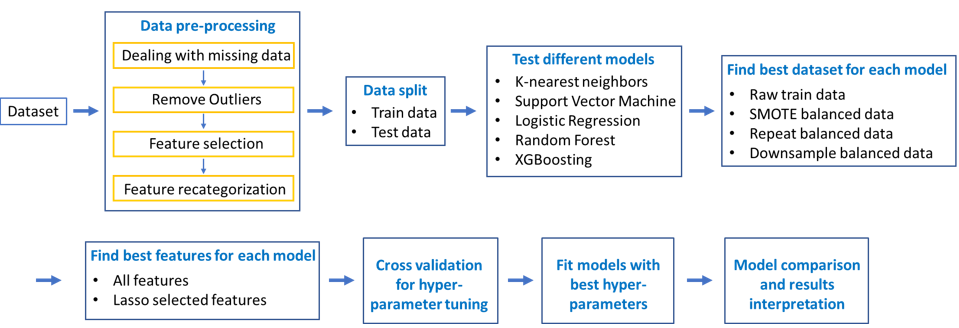
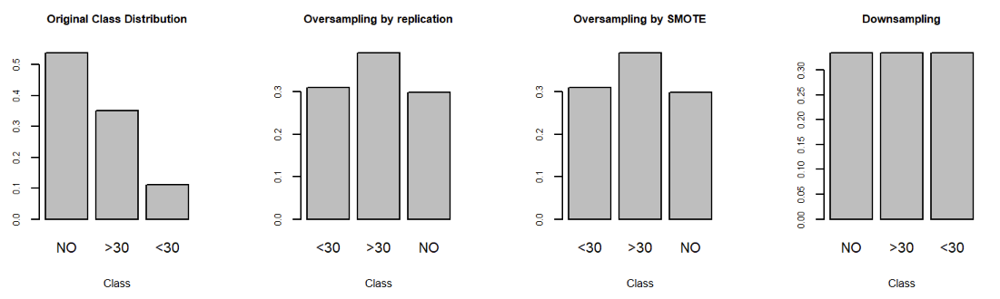
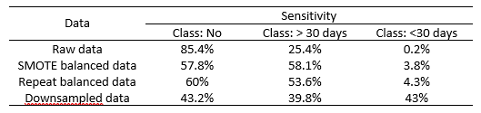

\vspace{-5truemm}

```{r setup, include=FALSE}
# knitr::opts_chunk$set(echo = TRUE, warning = F, message = F)
# seed.value <- 500310
# set.seed(seed.value)
# 
# install.custom <- function(package.name){
#   if(!(package.name %in% row.names(installed.packages()))){
#     install.packages(package.name)
#   } else {
#     print(paste0(package.name, " is already installed."))
#   }
#   library(package.name, character.only = T)
# }
# 
# install.custom("purrr")
# package_list <- c("broom"
#                   , "ggplot2"
#                   ,"tidyverse"
#                   , "lubridate"
#                   , "knitr"
#                   , "janitor"
#                   , "gridExtra"
#                   , "sf"
#                   , "dplyr"
#                   , "ggpubr"
#                   , "patchwork"
#                   , "corrplot"
#                   , "ggcorrplot"
#                   , "matrixStats"
#                   , "naniar"
#                   , "devtools"
#                   , "datapasta" 
#                   , "data.table"
#                   , "dtplyr"
#                   #, "tidymodels"
#                   , "xgboost"
#                   #, "vip"
#                   #, "GGally"
#                   , "glmnet"
#                   #, "ggthemes"
#                   #, "tidytext"
#                   , "rmarkdown"
#                   #, "openxlsx"
#                   #, "xlsx"
#                   , "Hmisc"
#                   , "mice"
#                   , "corrplot"
#                   #, "missForest"
#                   , "tidyverse"
#                   , "caret"
#                   , "smotefamily"
#                   , "dplyr"
#                   )
# 
# map(package_list, ~install.custom(.x))
```

## 1. Problem
Hospitalized diabetes patients have a higher risk of hospital readmission after discharge compared to the general population of hospitalized patients. This generates significant burden to the patients as well as the health care system. Therefore, identifying the diabetes patients that have the potential to be readmitted to hospital is an important health care target. In this study, we aim to generate an effective classification algorithm to predict whether the diabetes patients will be readmitted to hospital within 30 days or after 30 days of discharge, or will not be readmitted to hospital. This will provide valuable information for improving the management of targeted patients and help ease the burden on the healthcare system. 


## 2. Dataset description
For the purpose of this study, we used the ‘Diabetes 130-US hospitals for years 1999-2008 Data Set’ sourced from UCI Machine Learning repository, originally donated by Center for Clinical and Translational Research, Virginia Commonwealth University. The dataset represents 101,766 records of hospital admissions for patients diagnosed with diabetes across 130 US hospitals over a 10 year period (1999-2008). There are 55 categorical and numerical features in the data set that capture a variety of demographical and clinical information about the patients. Readmission status will be the response variable that we aim to predict with our classification models, and is labeled with three classes, readmitted after 30 days of discharge, within 30 days or no record of being readmitted.

## 3. Initial data analysis

### 3.1 Missingness
There are 11 variables containing missing values, as shown in Table below. Variables “Weight”, “medical_specialty” and
“payer_code” contains 96.86%, 49.08% or 39.56% missing data respectively, therefore, were removed from further analysis.
“admission_id” is not relevant to the readmission outcome, hence it was dropped from the analysis. The observations with
missing value in “gender” were removed. The remaining features with missing values had a high distinct levels, therefore we
further re-categorized these values to simplify the variables. The missing values were allocated to a suitable group.

```{r echo=FALSE, fig.cap="Missingness summary",  out.width = '30%', fig.align="center"}

```

### 3.2 Feature value re-categorization
There are some categorical variables contain many unique values. To assist further analysis, we have reduced the values by
re-categorizing the values. This include features for diagnosis (reducing from over 700 values to 9 values), admission source
(from 17 to 3), discharge disposition (from 26 to 2), admission type (from 7 to 3), and race (from 6 to 3). An example of the
feature value re-categorization, the feature values for diagnosis before and after re-categorization, is visualized in the table
and figure below.

```{r echo=FALSE, fig.cap="Feature Re-categorization",  out.width = '50%', fig.align="center"}

```

### 3.3 Outliers Removal
Based on the Interquartile Range rule, outliers were detected in features for number of lab procedures, number of medications
and number of diagnoses, as shown in Figure 3.We have excluded the outliers from the above 3 features, which means dropping
around 2.8% (2948) observations.

```{r echo=FALSE, fig.cap="Outliers detection",  out.width = '60%', fig.align="center"}

```

### 3.4 Feature Correlation
To understand the correlation of numerical predictors in the data, a correlation matrix was produced. It can be observed
that time in hospital forms a positive correlation with number of medication, lab procedures, procedures and number of
diagnoses. Number of medications also forms a relatively strong positive correlation with the number of procedures and
number of diagnoses. In addition, it is shown that when the number of emergency increases, number of inpatient will increase.

```{r echo=FALSE, fig.cap="Feature correlation",  out.width = '35%', fig.align="center"}

```

### 3.5 2D Heat maps
We generate 2D heat maps to study the distribution of race, number of diagnosis, diabetes medication and insulin category
in different age group. The brightness scale is logarithmic for visual purposes. We find that the majority of patients are
Caucasian and in the age range of 70 - 80. Most patients have had multiple diagnoses entered into the system and are already
on diabetes medication.

```{r echo=FALSE, fig.cap="52D Heat Maps",  out.width = '60%', fig.align="center"}

```

## 4. Approach 
The overall methodology of the current study is summarized in Figure 1.
```{r echo=FALSE, fig.cap="The methodology used in the current study.",  out.width = '70%', fig.align="center"}

```

## 5. Train/Test Split
Cleaned data was imported and train/test split was performed where 80% will go to train and 20% will go to test. 

## 6.Treating Imbalanced Class
One of the issues about the dataset is imbalanced class. From the bar plot below it can be observed that the class variable is dominated by the 'NO' level. If this issue is not treated properly, the trained classifier will tend to be more biased towards the major class and potentially not making any predictions on the minor classes. 

Therefore, to treat the imbalanced class issue, several techniques were perform as follows:
1. Oversampling by replicating instances from minor classes
2. Oversampling by SMOTE 
3. Downsampling

With oversampling by replicating instances from minor classes, we first subset for the two minor classes: <30 and >30. Then we replicated instances 5 times and 2 times respectively for each class, in order to make the dataset more balanced. In this way, we didn't introduce any artificial instances but this is likely to result in overfitting where training accuracy maybe high but the model is not good at predicting for unseen data. 

We also explored the option of SMOTE to oversample the minor classes. Instead of duplicating instances from the minority class that may lead to overfitting, SMOTE synthesizes new instances of the minority class between a random instance of the minority class and one of its k nearest neighbor (here K = 3). Given that most features in the data were categorical, one hot encoding was first performed. Since SMOTE generates new instances by calculating the distance between the random data point of the minority class and a random point of its neighbour, the raw results of new instances from SMOTE will generate decimals between 0 and 1. This adds no meaingful value to the data, therefore, an ifelse rule was created to round >0.5 to 1 and <0.5 to 0. Checks were also performed to ensure for each predictor, only one level will be 1 and the rest of the levels are 0. For new numerical instances, we also rounded the values to integer, aligning with the original data format. 

After oversampling techniques, the class distribution of the new data is approximately 4:3:3, which yields a more balanced dataset. 
We also explored the option of downsampling, we first converted categorical predictors to factors as a preliminary feature engineering step for future model training, then we applied the downSample function to downsample the major classes 'NO' and '>30' class so that 3 classes are now balanced. However, although we didn't introduce new or artificial instances, we may potentially lose some useful information.

```{r echo=FALSE, fig.cap="Class Distribution with different re-sampling techniques", out.width = '90%', fig.align="center"}

```

## 7. Feature Engineering

After performing train/test split and re-sampling, feature selection was performed to identify the potential subset of important features. Mutinomial Lasso regression was chosen as the feature selection algorithm as we aim to generate a simpler model with less features. Unlike Ridge regression that puts less weight on less important features, Lasso regression obtain the subset of predictors that minimizes prediction error by adding a regularization term to the cost function so coefficients for some variables are shrunk towards zero and being completely ignored.

A grid was generated to identify the best lambda in Lasso as we aim to find the balance between simplicity and model fit that minimizes the mse in cross validation. A 10-fold cross-validation for Lasso was performed with standardization to address the issue that variables are sharing different units. In the result, the best lambda that minimizes the cross-validation error was 0.0006. 

A subset of features were selected by Lasso. Lasso shrinks the model down from 23 predictors to 12 predictors and identifying race, gender, age, diag_3, number_diagnoses, admissiong_source, discharge_disposition, admission_type and some other medications as important features. However, one of the pitfalls of Lasso regression is that it does not provide much interpretability on why such features were selected, hence trial and error was conducted in later modelling stage to test if using Lasso selected features only will yield a better model against using all features.

## 8. Classification methods
To find the best classification algorithm for the current data, we tried 5 different classification algorithms, including K-nearest neighbor, support vector machine, logistic regression, random forest and XGBoosting. The algorithm aims to identify the patients who will readmit to hospital within 30 days and after 30 days, therefore, We choose sensitivity as the metrics to evaluate the algorithms, and more specially, the sensitivity of the "<30 days" and ">30 days" class groups. Besides sensitivity, we also determined F1 score and ROC of each algorithm, which provide additional information on the performance of algorithms. The methods to choose the best algorithm is illustrated in Figure 1. Firstly, we trained each model on a data set either without balanced class (raw train dataset), or dataset with balanced class (SMOTE balanced dataset, repeat balanced dataset and downsample balanced dataset), to find the dataset with best sensitivity for the 2 classes. 
For random forest model, we also evaluated different functions, i.e. RandomForest, ranger and ordinal forest. Then hyper-parameter tuning was performed on each model using grid search cross validation (5 or 10 folds based on computational time of specific algorithms). 
For $k$-nearest neighbors, we computed the optimal $k$ from a grid of 20 values using 5 folds and the SMOTE balanced data set. This $k$ value was then used for the data set with additional repetitions to determine the optimal data set. 
The suport vector machine method was run on the different data sets and feature selection from Lasso to find the best combination. Hyper-parameter tuning using grid search 5-Fold cross validation was also employed to find the best combination of hyperparameter to result highest performance. 
From those experiments, we found that by using SMOTE data, with all features, it yielded the best performance with test data. 
We then tried multinomial logistic regression, which predicts the probability of class membership. The set of parameters for the model are optimized through maximum likelihood estimation. We fit several models on different preprocessed data, raw data vs balanced data, full features vs Lasso selected features and find out the optimal model based on sensitivity, F1, ROC metrics. 
For random forest, we searched the hyper-parameters num.trees in (1000, 2000, 4000, 6000, 8000, 10000, and mtry in (2,3,4,5,6) with 5 fold cross validation. 
***For XGBoosting,.... (Leonard to complete)*** 
We then compared the performance of these different algorithms with hyperparameters already tuned using the recall score and computational time. 

## 9. Results

### 9.1 *k*-Nearest Neighbour
The first algorithm we used is the *k*-nearest neighbours algorithm. 
While simple in nature, a disadvantage of the algorithm is speed if there are a large number of observations and/or variables.
Due to the large data set, a single run of the kNN algorithm takes $\sim 15$ minutes for the raw data set (using $k = 1$, larger values are even more computationally expensive).
Thus, if we use 5 folds and try 100 $k$ values, this will take $\sim 100$ hours to run. 
We considered dimensional reduction using PCA, but this was discarded because most of our data is categorical (18 categorical, 5 continuous) and it is very challenging to represent distances with the categorical data in factorial space. 
Additionally, we tried Lasso regression to only use the dominant features, but found this only reduced the accuracy of our model without significantly lowering the amount of computational time. 

Instead, we optimised the efficiency using two methods:

1. Limiting the number of $k$ values during our tuning. A way to estimate the optimal $k$ value is $\sqrt{N}$ where N is the total number of samples (140, 000 for SMOTE/oversampled data) in the training set. We then use a grid search of $21\ k$ values from 270 to 470 in increments of 10 as $\sqrt{N} \sim 370$ in our case. As we have three possible classes, we do not require an odd $k$ value.
2. Running the code in parallel using 4 cores will also help reduce the time required.

Finally, we considered using different distance metrics for the kNN algorithm. From a review paper of the effect of distance measure choice on performance metrics such as accuracy, recall and precision show insignificant variations with the possible metrics available on R (Prasatha et al. 2019). Hence, we adopt the default Euclidean distance metric.

We ran $k$-NN for all three data sets (raw, SMOTE and oversampled by repetition), and found that the data that used repetitions to oversample performed the best at predicting "$<30$" and "$>30$" classes.

```{r echo=FALSE, fig.cap="Heat map of confusion matrix for kNN algorithm", out.width = '70%', fig.align="center"}
knitr::include_graphics("CM_plot.pdf")
```

We find $k$-NN yields a sensitivity of $25.0 \%$ and $70.7 \%$ and specificities $80.6 \%$ and $36.0 \%$ for the "$<30$" and "$>30$" classes respectively. 
These results illustrate that the algorithm struggles in finding differences between the classes using the features used in the data set.

### 9.2 Random Forest


Random forest algorithm had the best sensitivity score using downsample balanced data, with sensitivity of 39.8% for ">30 days" class, and sensitivity of 43.0% for "<30 days" class. Using raw data, repeat balanced data or SMOTE balanced data, the sensitivity for "<30 days" class is obviously lower, ranging from 0.2% to 4.3%. The sensitivity scores when using Random forest and ranger are similar but slightly better than ordinal forest, while ranger is much faster than Random forest, therefore, ranger was chosen in the current study. Hyper-parameter tuning showed that number of trees = 8000, and number of variables = 2 yield the best out of bag errors. Evaluating the model with best hyper-parameters showed sensitivity scores of the target groups were 42.61% and 41.64% respectively, and F1 scores were 42.7% and 22.4% respectively. The number of diagnosis was identified to be the most important variables in this classifier.

```{r echo=FALSE, fig.cap="The sensitivity of random forest algorithms using different training dataset.", out.width = '60%', fig.align="center"}

```

### 9.3 Support vector machine
As mentioned previously, the best SVM result is obtained from SMOTE balanced dataset with all features with the sensitivity of 47.59% for class "<30 days", 47.16% for class ">30 days", and 43.4% for class "No". 
With undersampled data, the average sensitivity score for 3 classes is slightly lower in around 42.5%. Next, we tested our model to only some important features that are generated by Lasso. The result is lower as expected, which only around 40%, but better for class ">30 days" in 48.38% sensitivity.
Those scores is quite good because it can balance the performance for the 3 classes. In contrast, experiment with raw data yielded 39.75% average sensitivity. However, if we broke down to each class, the sensitivity scores were 17.58%, 61.11%, 40.55$ respectively for class "<30 days", ">30 days", and class "No". Full result can be seen below

```{r echo=FALSE, fig.cap="The sensitivity of SVM algorithms on different datasets.", out.width = '60%', fig.align="center"}
knitr::include_graphics("SVM Result.png")
```

Before experiments, we conducted hyper-parameter tuning using 5-Fold Cross Validation as follow:

| Hyper-parameter | Value          |
|-----------------|----------------|
| Kernel          | Linear, Radial |
| Gamma           | 0.1, 1         |
| C               | 0.1, 1         |

All the experiments were using the best hyper-parameters as seen below:

- Kernel: Radial based
- Gamma: 1
- C: 1

### 9.4 Logistic regression 
For logistic regression, raw data with all features gives the best accuracy of 54%, however, the sensitivity is highly skewed with no instances predicted to be in the class '<30 days'. This caused problem as the two classes that we're most interested in is patients who readmitted. Data with lasso selected features also posed the same problem.
We then tried other class balancing approaches and downsampled dataset gives the best result, in the sense that it has highest sensitivity for class "<30 days" (36.2%) and ">30 days" (44.0%) compared to oversampled dataset. Its accuracy is lower 42.8% with more testing error, but overall predicts better for the minor classes and fits better for the purpose of our study. In addition, running the algorithm takes around 15 seconds and is more computationally efficient.

### 9.5 XGBoosting (Leonard to add)


### 9.6 Model comparision 
We have used a diverse range of models to tackle this diabetes data set. 
To compare these models, we refer back to our problem statement where we seek to optimise the model to have less negatives as a priority.
Our key focus is the case where patients are readmitted to hospital within 30 days of discharge ("$<30$" class).
Hence, we will define the "$<30$" class as 'positive' and the other two classes as 'negative' in our model comparison.
In this case, a false negative will mean the hospital will not account for potential early readsmission, resulting in an adverse outcome for both hospital and patient. 

```{r echo=FALSE, fig.cap="Model comparison using recall, precision and F1 metrics with positive class assigned to '<30'.", out.width = '60%', fig.align="center"}
# knitr::include_graphics("xxx.png") Leonard to add photo from his slide
```

For our purpose, we use the recall score (TP/(TP + FN)) to evaluate and compare our models because of the importance of false negatives.
Across our 5 models, we find the SVM algorithm trained on the data treated with SMOTE performs the best using this metric (smaller amount of false negatives).
Using the F1 score, which is a more balanced score minimising both FP and FN, the SVM method is also favoured over the other models.


## 10. Discussion and conclusion

In the current study, the radial SVM algorithm was identified to be the best classifier. 
It can be used to identify the diabetes patients who have potential to be readmitted to hospital within 30 days and after 30 days of discharge, with a sensitivity of ..% and ..% respectively. 
In contrast, the $k$-NN method failed to be particularly sensitive to hospital readmission, especially for patients readmitted within 30 days of discharge.
Our logistic regression algorithm has the advantage over other methods used such as $k$-NN by being far faster to run. 
Ultimately however, the algorithm fails to predict the two classes of readmissions accurately 
We used 2 ensemble algorithms in this study, random forest and XGBoosting, however, their performance was not better than SVM. 
Random forest is generally a powerful algorithm, it can handle large data with multiple variables. 
However, random forest can be biased when categorical variables have multiple levels. 
In our dataset, 14 out of 23 variables are multilevel variables, which may prevent the accuracy of random forest algorithm.
***xGBoosting.......discussion.... (Leonard to add)***

There are a few ways to improve the classification. Firstly, the minority class "<30 days" and "> 30 days" can be combined, as the patients in these groups have similar clinical meanings, i.e. will be readmitted to hospital after discharge. This will change the multiclass classification problem into binary classification problem, and increase the observation number in the minority class, which will improve the performance of classifier. We can also increase the observation number of the minority classes, reduce categorical variable levels by recategorization, adjust the threshold to improve sensitivity in the current models. We can also try other classification algorithms, including 1) Linear discriminant analysis, which is capable with multiple class classification, or 2) Adaboosting, which algorithm can improve its performance by emphasizing the misclassified data, or 3) classification neural network, which can use a series of algorithms for classification problem, and is suitable for non-linear data, which our current data appears to be, although it may take longer computational time.

\pagebreak
## Contribution Statement
All members of the group contributed equally to the project. More specifically, the following was completed by each member:

* HL
* JC
* JS
* LS
* ML
* SW during the IDA contributed heat maps studying the distribution of the population of diabetes patients. For the analysis, SW worked on developing the $k$-NN model. SW helped put together the final report.


